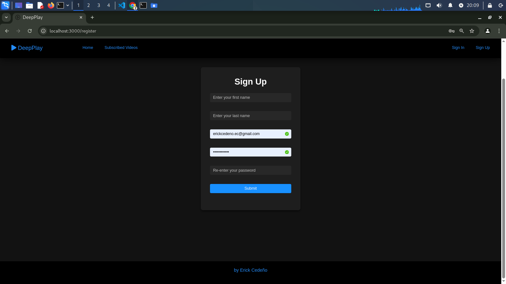
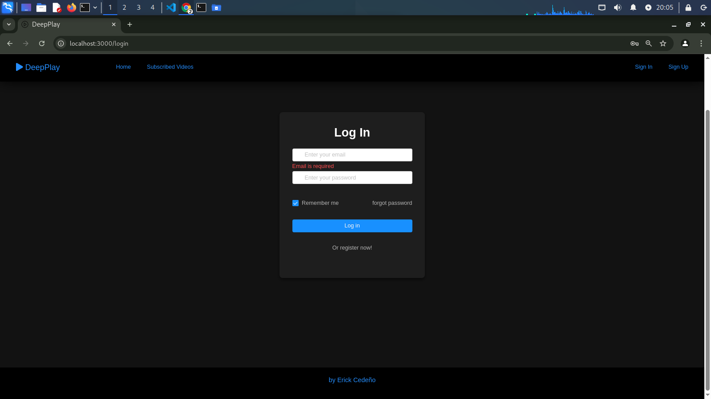
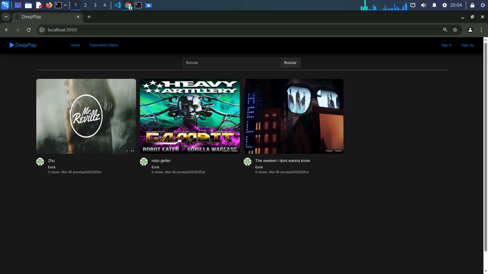
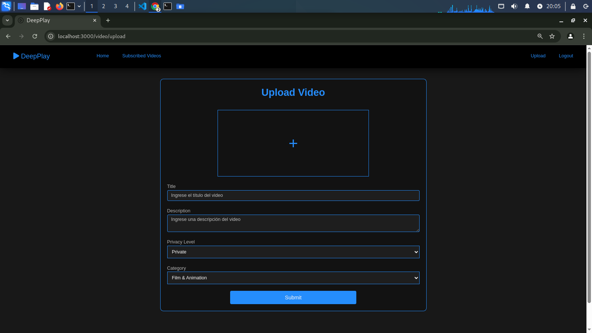
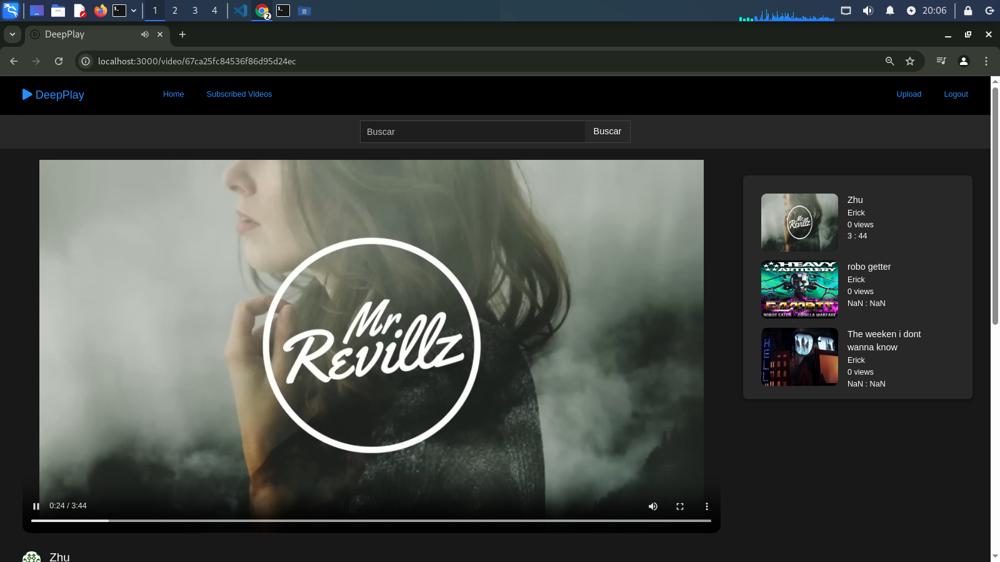
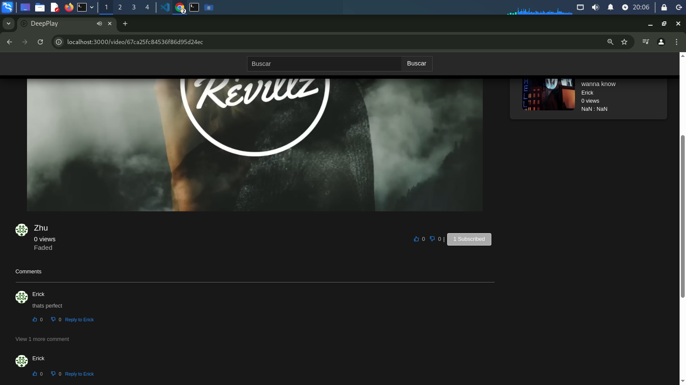

# DeepPlay

## 🛠️ Tecnologías Stack
-  **React**
-  **Node.js**
-  **Express.js**
-  **MongoDB**


## Installation
1. Clone this repository  
```bash
$ https://github.com/Erick-MC-Cedeno/Video-Play-DeepPlay
```

# install frontend dependencies

```
$ cd Video-Play-DeepPlay
```

```
$ cd client

```

```
$ cd npm install

```

# install backend dependencies

```
cd Video-Play-DeepPlay

```
npm install 

```
```

# start project 

npm run dev


## Features
### Sign Up Page



### Sign In Page



### Homepage



### Subscribed Videos


### Upload a Video



### Watch a Video



### Reactions



## Dependencies
- [Axios](https://github.com/axios/axios): a promise-based HTTP client for NodeJS
- [Ant Design](https://ant.design): a front-end framework used for styling simple and natural user interfaces
- [Express](https://expressjs.com): a back-end webapp framework for dealing with server-side requests
- [ffmpeg](https://ffmpeg.org): a library that was used to aid in video streaming for this webapp
- [JsonWebToken (JWT)](https://jwt.io): a secure way for transmitting information between parties as a JSON object
- [MomentJS](https://momentjs.com): a datetime library for JavaScript
- [Mongoose / MongoDB](https://www.mongodb.com): A general purpose NoSQL DBMS
- [ReactJS](https://reactjs.org): A front-end library developed by Facebook that is used for building front-end user interfaces
- [React-Redux](https://react-redux.js.org): used in conjunction with ReactJS to coordinate state management
- [React-Router](https://www.npmjs.com/package/react-router): handles routing endpoints in a webapp via dynamic routing
- [React-Dropzone](https://react-dropzone.js.org): a ReactJS hook library used for drag-and-drop file components

